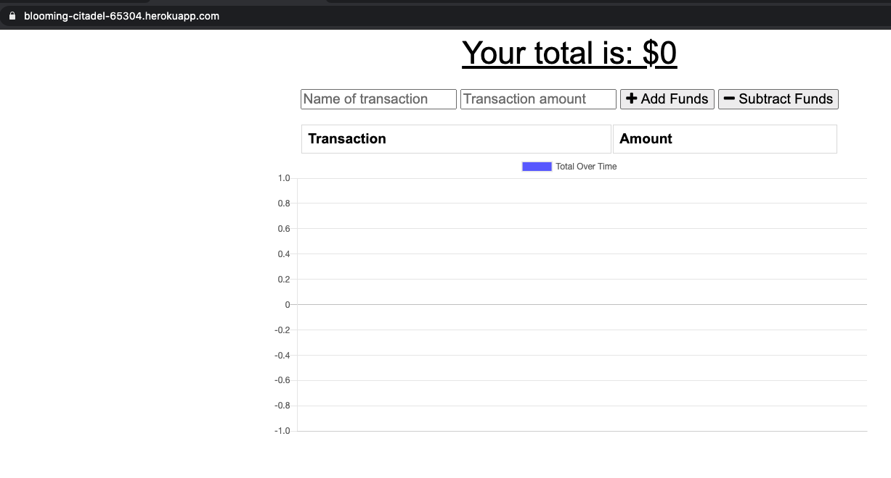

# Budget Tracker

## Description
Update an existing budget tracker application to allow for offline access and functionality. The user will be able to add expenses and deposits to their budget with or without a connection. If the user enters transactions offline, the total should be updated when they're brought back online.
## Table of Contents
* [Installation](#installation)
* [Usage](#usage)
* [Image](#image)
* [License](#license)
* [Credits](#credits)
* [Tests](#tests)
* [Questions](#questions)
## Installation
clone repo and install npm dependencies and run npm start.
## Usage
None at the moment.
### Image:

## License
Licensed under MIT.
## Credits
* W3Schools www.w3schools.com/  
* Stack OverFlow www.stackoverflow.com/
## Tests
N/A
## Questions
Please feel free to contact me. GitHub & LinkedIn links provided below along with my Email.
* [GitHub](github.com/saul10huerta)
* [Email](saul10huerta@utexas.edu)
* [LinkedIn](https://www.linkedin.com/in/saul10huerta/)